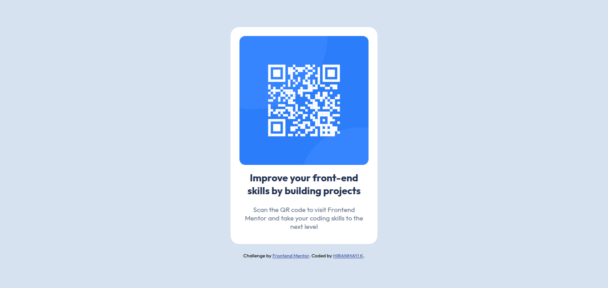

# Frontend Mentor - QR code component solution

This is a solution to the [QR code component challenge on Frontend Mentor](https://www.frontendmentor.io/challenges/qr-code-component-iux_sIO_H). Frontend Mentor challenges help you improve your coding skills by building realistic projects. 

## Table of contents

- [Overview](#overview)
  - [Screenshot](#screenshot)
  - [Links](#links)
- [My process](#my-process)
  - [Built with](#built-with)
  - [What I learned](#what-i-learned)
  - [Continued development](#continued-development)
  
- [Author](#author)

## Overview

### Screenshot

### Links

- Solution URL: [Add solution URL here](https://your-solution-url.com)
- Live Site URL: [Add live site URL here](https://your-live-site-url.com)

## My process

I began by building a semantic HTML structure to contain the QR code, heading, and supporting paragraph. This provided a solid foundation for the layout.
I moved on to styling with CSS. I applied a CSS reset using the universal selector (* { margin: 0; padding: 0; }) to ensure consistent spacing across browsers. For the main layout, I styled the body using Flexbox.The .outer-box and .card classes were used to structure the component.
For responsiveness and visual consistency, the image was styled to fit its container fully (width: 100%) and given rounded corners with border-radius. 
Overall, I aimed for a centered layout with clean design principles using only HTML and CSS.

### Built with

- Semantic HTML5 markup
- CSS custom properties
- Flexbox

### What I learned

In this project, I learned how to import fonts from Google Fonts and use them in my design. I also got good practice using basic HTML and CSS. It helped me understand how to structure a page and style it using Flexbox to center content and create a clean layout. As a beginner, this was a great way to apply what I’ve been learning.

### Continued development

I'm still learning and getting more comfortable with using Flexbox. In future projects, I want to focus more on how to use Flexbox effectively for different layouts. I also plan to keep practicing CSS techniques to improve my styling skills and build more responsive designs.

## Author

- Frontend Mentor - [@hiranmayi28](https://www.frontendmentor.io/profile/hiranmayi28)

# QR-Code-Card
